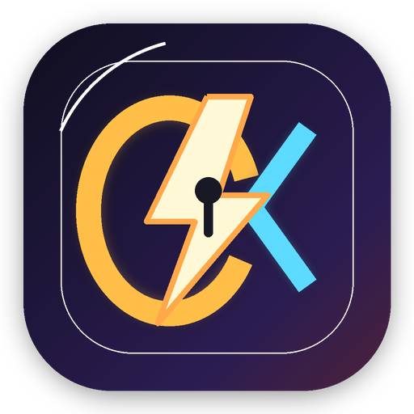

<div align="center">



# OhMyCodex

**让 OpenAI Codex 桌面版接入任意 OpenAI 兼容模型**

[](https://github.com/l-jessie/oh-my-codex/releases)
[](LICENSE)
[](#安装)

</div>

---

## ✨ 这是什么

OhMyCodex 是一个本地代理网关 + Electron 控制面板，它可以拦截 Codex Desktop 的 API 请求，将其转发到你指定的任意 OpenAI 兼容接口（DeepSeek、SiliconFlow、小米 MiMo、自建服务等），从而让 Codex 使用非官方模型。

**简单来说：** 装上 OhMyCodex → 填入你的 API Key → Codex 下拉菜单里就能选你自己的模型了。

## 🚀 功能特性

- 🔌 **即插即用** — 自动 patch Codex 配置，无需手动编辑 `config.toml`
- 🎯 **多厂商支持** — DeepSeek、SiliconFlow、OpenAI、小米 MiMo 或任何 OpenAI 兼容接口
- 📋 **多模型管理** — 同时添加多个模型，Codex 下拉菜单自由切换
- 👁️ **视觉模型** — 支持配置独立的视觉模型（截图识别），可复用主模型或独立配置
- 📡 **实时日志** — 内置日志大屏，实时查看请求转发状态
- 🖥️ **原生桌面 UI** — Electron 玻璃拟态控制面板，支持中英文
- 🔄 **一键重启** — 保存配置后自动重启 Codex Desktop
- ↺ **一键还原** — 恢复 Codex 原生状态，自定义模型对话保留
- 🍎 **macOS 菜单栏常驻** — 关闭窗口后隐藏到系统托盘，左键打开 / 右键退出
- 💻 **Windows 兼容** — 支持 NSIS 安装包和便携版

## 📦 安装

### 下载安装包

前往 [Releases](https://github.com/l-jessie/oh-my-codex/releases) 页面下载：

| 平台 | 文件 | 说明 |
|------|------|------|
| macOS | `OhMyCodex-x.x.x-arm64.dmg` | Apple Silicon (M1/M2/M3/M4) |
| macOS | `OhMyCodex-x.x.x-x64.dmg` | Intel Mac |
| Windows | `OhMyCodex-Setup-x.x.x.exe` | NSIS 安装包（推荐） |
| Windows | `OhMyCodex-x.x.x.exe` | 便携版（免安装） |

### macOS 安装注意

首次打开可能提示"无法验证开发者"，请执行：

```bash
xattr -cr /Applications/OhMyCodex.app
```

## 🛠️ 从源码构建

```bash
# 克隆仓库
git clone https://github.com/l-jessie/oh-my-codex.git
cd ohmycodex

# 安装依赖
npm install

# 开发模式（热更新）
npm run dev

# 构建打包
npm run build:mac     # macOS DMG + ZIP
npm run build:win     # Windows EXE (NSIS + Portable)
```

## 📖 使用方法

1. **启动 OhMyCodex** — 打开应用后自动启动本地代理网关（端口 16868）
2. **填写 API 配置** — 点击右上角 ⚙️ 设置，填入你的 Base URL 和 API Key
3. **拉取模型列表** — 点击"拉取模型列表"获取该接口支持的模型
4. **选择模型** — 在模型列表中勾选想在 Codex 里使用的模型
5. **保存并重启** — 点击"保存配置"，Codex 自动重启后下拉菜单即可看到新模型
6. **开始使用** — 打开 Codex Desktop，选择你添加的模型开始对话

### 配置示例

| 服务商 | Base URL | 说明 |
|--------|----------|------|
| DeepSeek | `https://api.deepseek.com/v1` | 官方接口 |
| SiliconFlow | `https://api.siliconflow.cn/v1` | 硅基流动 |
| 小米 MiMo | `https://api.xiaomimimo.com/v1` | 小米大模型 |
| OpenAI | `https://api.openai.com/v1` | 官方 OpenAI |
| 自建 | `http://your-server:port/v1` | 任何兼容接口 |

## 🏗️ 技术架构

```
┌─────────────────────────────────────────────┐
│            OpenAI Codex Desktop              │
│         (config.toml → ohmycodex)            │
└──────────────────┬──────────────────────────┘
                   │ HTTP (localhost:16868)
┌──────────────────▼──────────────────────────┐
│            OhMyCodex Gateway                 │
│  ┌──────────┐  ┌──────────┐  ┌───────────┐ │
│  │ Proxy    │  │ Config   │  │ Computer  │ │
│  │ Server   │  │ Manager  │  │ Use (MCP) │ │
│  └────┬─────┘  └──────────┘  └───────────┘ │
│       │                                      │
│  ┌────▼──────────────────────────────────┐  │
│  │  Provider Manager (per-provider dirs) │  │
│  │  ~/.ohmycodex/providers/<uuid>/       │  │
│  └────┬──────────────────────────────────┘  │
└───────┼──────────────────────────────────────┘
        │ HTTPS
        ▼
  ┌──────────────┐
  │  Model API   │  (DeepSeek / SiliconFlow / ...)
  └──────────────┘
```

- **Electron** — 原生桌面窗口 + 系统托盘
- **Node.js HTTP Server** — 本地代理网关，转发 Codex 请求
- **MCP Server** — Computer Use 工具（截图、键鼠操作、窗口管理）
- **React** — 设置面板 UI
- **SSE/HTTP Polling** — 实时日志推送

## 📁 项目结构

```
ohmycodex/
├── electron/
│   ├── main.ts          # Electron 主进程（窗口 + 托盘）
│   └── preload.ts       # Preload 脚本
├── src/
│   ├── renderer/
│   │   ├── App.tsx      # React 控制面板 UI
│   │   ├── styles.css   # 全局样式
│   │   └── main.tsx     # React 入口
│   ├── proxy/
│   │   ├── index.ts     # 代理网关核心（路由、配置、日志）
│   │   ├── translator.ts # Responses ↔ Chat 格式转换
│   │   └── dashboard.ts # 旧版 Dashboard HTML
│   ├── cu/
│   │   ├── screenshot.ts # 截图（macOS Swift / Windows PowerShell）
│   │   └── actions.ts   # 键鼠操作（macOS CGEvent / Windows P/Invoke）
│   └── server.ts        # MCP Server 入口
├── build/               # 图标资源
├── package.json
└── README.md
```

## ⚙️ 配置文件位置

| 文件 | 路径 | 说明 |
|------|------|------|
| 全局设置 | `~/.ohmycodex/settings.json` | 活跃 provider、日志级别 |
| 厂商配置 | `~/.ohmycodex/providers/<uuid>/config.json` | API 地址、Key、模型列表 |
| 视觉配置 | `~/.ohmycodex/providers/<uuid>/vision.json` | 视觉模型设置 |
| 模型目录 | `~/.ohmycodex/custom_model_catalog.json` | Codex 下拉菜单模型列表 |
| 日志文件 | `~/.ohmycodex/logs/ohmycodex-YYYYMMDD.log` | 每日日志 |
| Codex 配置 | `~/.codex/config.toml` | 自动 patch 的 Codex 配置 |

## 🤝 Contributing

欢迎提交 Issue 和 Pull Request！

```bash
npm run dev    # 启动开发模式
npm run build  # 构建验证
```

## 📄 License

[MIT](LICENSE)
